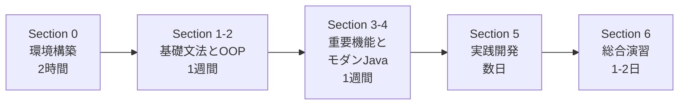

# Java Bootcamp

> Javaを短期間で集中して学ぶための実践的な教科書プロジェクト

!!! success "ようこそ！"
    このBootcampでは、プログラミング経験者がJavaを効率的に習得できるよう、体系的で実践的なカリキュラムを提供します。

## プロジェクトの特徴

<div class="grid cards" markdown>

-   :material-book-open-page-variant:{ .lg .middle } __体系的なカリキュラム__

    ---

    6つのセクションで段階的に学習。基礎から実践まで網羅的にカバー。

-   :material-code-braces:{ .lg .middle } __実践重視__

    ---

    豊富なコード例と練習問題で、実際に手を動かして学べます。

-   :material-language-java:{ .lg .middle } __モダンなJava__

    ---

    Java 17以降の最新機能に対応。ラムダ式、Stream APIなど。

-   :material-clock-fast:{ .lg .middle } __効率的な学習__

    ---

    約30-40時間で完了可能。集中学習なら2-3週間で習得。

</div>

## 対象者

このBootcampは以下のような方を対象としています：

- :material-check: 他のプログラミング言語の経験があり、Javaを学びたい方
- :material-check: Javaの基礎を体系的に学び直したい方
- :material-check: モダンなJavaの機能を習得したい方
- :material-check: エンタープライズ開発のスキルを身につけたい方

!!! info "前提知識"
    以下の知識があることを前提としています：

    - 基本的なプログラミング概念（変数、関数、条件分岐、ループなど）
    - コマンドラインの基本操作
    - テキストエディタまたはIDEの使用経験

## カリキュラム概要

!!! tip "学習の進め方"
    各セクションを順番に進めることをおすすめします。総学習時間は約30-40時間です。

### :material-rocket-launch: Section 0: イントロダクション

Javaの世界へようこそ。まずは開発の準備を整え、最初のプログラムを動かしてみます。

| レッスン | トピック | 所要時間 |
|---------|---------|----------|
| [0-1. Javaとは](section-0/0-1-what-is-java.md) | Javaの特徴、JVMの仕組み | 30分 |
| [0-2. 開発環境の構築](section-0/0-2-setup.md) | JDK、IDEのセットアップ | 45分 |
| [0-3. Hello, World!](section-0/0-3-hello-world.md) | 最初のプログラム | 20分 |
| [0-4. プロジェクトの基本構造](section-0/0-4-project-structure.md) | パッケージとクラス | 25分 |

### :material-file-code: Section 1: Javaの基本

プログラミングの基礎となる文法やデータ構造を学びます。

| レッスン | トピック | 所要時間 |
|---------|---------|----------|
| [1-1. 変数とデータ型](section-1/1-1-variables-and-types.md) | プリミティブ型、参照型 | 60分 |
| [1-2. 演算子](section-1/1-2-operators.md) | 算術、比較、論理演算子 | 40分 |
| [1-3. 制御フロー](section-1/1-3-control-flow.md) | if文、switch文、ループ | 50分 |
| [1-4. 配列](section-1/1-4-arrays.md) | 配列の操作 | 45分 |

### :material-cube-outline: Section 2: オブジェクト指向プログラミング

Javaの核心であるオブジェクト指向の考え方をマスターします。

| レッスン | トピック | 所要時間 |
|---------|---------|----------|
| [2-1. クラスとオブジェクト](section-2/2-1-classes-and-objects.md) | クラスの定義と使用 | 60分 |
| [2-2. メソッドとコンストラクタ](section-2/2-2-methods-and-constructors.md) | メソッドの定義 | 55分 |
| [2-3. カプセル化](section-2/2-3-encapsulation.md) | アクセス修飾子 | 40分 |
| [2-4. 継承](section-2/2-4-inheritance.md) | クラスの継承 | 50分 |
| [2-5. ポリモーフィズム](section-2/2-5-polymorphism.md) | 多態性 | 55分 |
| [2-6. 抽象クラスとインターフェース](section-2/2-6-abstract-and-interface.md) | 抽象化 | 60分 |

### :material-tools: Section 3: Javaの重要機能

より高度で実践的なアプリケーション開発に不可欠な機能を学びます。

| レッスン | トピック | 所要時間 |
|---------|---------|----------|
| [3-1. 例外処理](section-3/3-1-exception-handling.md) | try-catch、例外の種類 | 50分 |
| [3-2. コレクションフレームワーク](section-3/3-2-collections.md) | List、Set、Map | 70分 |
| [3-3. ジェネリクス](section-3/3-3-generics.md) | 型パラメータ | 55分 |
| [3-4. ファイル入出力](section-3/3-4-file-io.md) | ファイルの読み書き | 60分 |

### :material-lightning-bolt: Section 4: モダンJava

Java 8以降で導入された、より簡潔で強力なコーディングスタイルを習得します。

| レッスン | トピック | 所要時間 |
|---------|---------|----------|
| [4-1. ラムダ式](section-4/4-1-lambda.md) | 関数型プログラミング | 55分 |
| [4-2. Stream API](section-4/4-2-stream-api.md) | データ処理パイプライン | 75分 |
| [4-3. Optional](section-4/4-3-optional.md) | null安全 | 40分 |

### :material-application: Section 5: 実践開発への一歩

実際の開発現場で使われるツールや技術に触れます。

| レッスン | トピック | 所要時間 |
|---------|---------|----------|
| [5-1. ビルドツール入門](section-5/5-1-build-tools.md) | Maven、Gradle | 60分 |
| [5-2. ユニットテスト](section-5/5-2-unit-testing.md) | JUnit 5 | 70分 |
| [5-3. データベース接続](section-5/5-3-jdbc.md) | JDBC | 65分 |

### :material-trophy: Section 6: 総合演習

これまでの知識を総動員して、小規模なコンソールアプリケーションを設計・実装します。

| レッスン | トピック | 所要時間 |
|---------|---------|----------|
| [6. 総合演習プロジェクト](section-6/6-final-project.md) | アプリケーション構築 | 4-6時間 |

## クイックスタート

!!! example "3ステップで始めよう"
    1. **環境構築**: [開発環境の構築](section-0/0-2-setup.md)を参照してJDKとIDEをセットアップ
    2. **Hello World**: [Hello, World!](section-0/0-3-hello-world.md)で最初のプログラムを実行
    3. **学習開始**: Section 1から順番に進めていきましょう

## 学習の進め方

### 基本的な学習フロー



### 効果的な学習方法

=== "実践重視"
    - コード例は必ず自分で入力して実行する
    - 単にコピー&ペーストせず、理解しながら書く
    - 練習問題に必ず取り組む

=== "エラー学習"
    - エラーメッセージを注意深く読む習慣をつける
    - スタックトレースの読み方を学ぶ
    - よくあるエラーパターンを理解する

=== "復習と反復"
    - 理解が曖昧な部分は前のセクションに戻る
    - 定期的に過去のコードを見直す
    - 各セクションの「まとめ」で重要ポイントを確認

=== "応用と発展"
    - Section 6では自分なりのアレンジを加える
    - 学んだ内容で小さなプロジェクトを作る
    - 興味のある分野により深く取り組む

### 学習スケジュール例

| プラン | ペース | 期間 | 詳細 |
|--------|--------|------|------|
| **集中学習** | 週3-4日、1日2-3時間 | 2-3週間 | 短期間で集中して習得 |
| **通常学習** | 週2-3日、1日1-2時間 | 1-2ヶ月 | 着実に基礎を固める |
| **マイペース** | 週1-2日、1日1時間 | 3-4ヶ月 | 自分のペースでじっくり |

## 必要な環境

### ソフトウェア要件

| 項目 | 最小要件 | 推奨 |
|------|----------|------|
| **JDK** | JDK 17以降 | **JDK 21 LTS** |
| **IDE** | テキストエディタ | IntelliJ IDEA Community |
| **ビルドツール** | - | Maven 3.6+ (Section 5で使用) |

!!! info "IDE の選択肢"
    - **IntelliJ IDEA Community Edition** (推奨) - 高機能で初心者にも優しい
    - **VS Code + Extension Pack for Java** - 軽量で拡張性が高い
    - **Eclipse IDE for Java Developers** - 老舗のJava IDE

### ハードウェア要件

| 項目 | 最小要件 | 推奨 |
|------|----------|------|
| **OS** | Windows 10、macOS 11、Ubuntu 18.04 | Windows 11、macOS 13、Ubuntu 22.04 |
| **メモリ** | 4GB | 8GB以上（IDE使用時は16GB） |
| **ディスク容量** | 2GB | 5GB以上 |
| **プロセッサ** | 2コア | 4コア以上 |

## 学習のヒントと実践方法

!!! success "効果的な学習のために"
    - :material-keyboard: **アクティブラーニング**: コードを必ず自分で書いて実行
    - :material-alert-circle: **エラー駆動学習**: エラーは学習の機会と捉える
    - :material-book-open: **ドキュメント活用**: JavaDocを読む習慣をつける
    - :material-lightbulb: **実践プロジェクト**: 学んだことで小さなアプリを作る

### よくある質問（FAQ）

??? question "プログラミング初心者でも大丈夫ですか？"
    このBootcampはプログラミング経験者向けの内容です。全くの初心者の方は、まず以下のような基本的なプログラミング概念を学ぶことをおすすめします：

    - 変数とデータ型
    - 条件分岐とループ
    - 関数の概念

    入門向けリソース：[Progate](https://prog-8.com/)、[ドットインストール](https://dotinstall.com/)

??? question "どれくらいの期間で完了できますか？"
    学習ペースによって異なります：

    - **集中学習**: 1日2-3時間 × 2-3週間 = 約30-40時間
    - **通常ペース**: 週2-3日、1日1-2時間 × 1-2ヶ月
    - **マイペース**: 週1-2日 × 3-4ヶ月

    重要なのは、理解しながら進めることです。急がず、確実に理解してから次に進みましょう。

??? question "練習問題はありますか？"
    はい、各セクションに練習問題と実践例があります：

    - 各章の最後に練習問題
    - Section 6で総合演習プロジェクト

    さらに練習したい方へ：

    - [LeetCode](https://leetcode.com/) - アルゴリズム問題
    - [HackerRank](https://www.hackerrank.com/domains/java) - Java特化の問題
    - [Exercism](https://exercism.org/tracks/java) - メンター付き練習問題

??? question "つまずいたときはどうすればいいですか？"
    以下の手順で解決を試みましょう：

    1. エラーメッセージをよく読む
    2. 公式ドキュメントを確認する
    3. Google検索で「Java [エラーメッセージ]」で検索
    4. [Stack Overflow](https://stackoverflow.com/questions/tagged/java)で類似の質問を探す
    5. GitHub Discussionsで質問する

??? question "このBootcamp修了後、次に何を学べばいいですか？"
    修了後の学習パス：

    - **Webアプリケーション開発**: Spring Boot、Spring Framework
    - **データベース**: SQL、JPA/Hibernate
    - **クラウド**: AWS、Azure、GCP
    - **マイクロサービス**: Docker、Kubernetes
    - **デザインパターン**: GoFパターン、アーキテクチャパターン

## 学習の進捗管理

各セクションを完了したら、チェックリストで進捗を確認しましょう：

- [ ] :material-rocket-launch: Section 0: イントロダクション
- [ ] :material-file-code: Section 1: Javaの基本
- [ ] :material-cube-outline: Section 2: オブジェクト指向プログラミング
- [ ] :material-tools: Section 3: Javaの重要機能
- [ ] :material-lightning-bolt: Section 4: モダンJava
- [ ] :material-application: Section 5: 実践開発への一歩
- [ ] :material-trophy: Section 6: 総合演習

## 関連リソース

### :material-file-document: 公式ドキュメント

| リソース | 説明 |
|---------|------|
| [Oracle Java Documentation](https://docs.oracle.com/en/java/) | 公式Java開発者向けドキュメント |
| [Java API Specification](https://docs.oracle.com/en/java/javase/21/docs/api/) | Java SE 21のAPIリファレンス |
| [OpenJDK](https://openjdk.org/) | オープンソースJDK実装 |

### :material-book: おすすめの書籍

=== "初級〜中級"
    - **『スッキリわかるJava入門 第4版』** - 中山清喬
    - 『Javaの絵本』 - アンク

=== "中級〜上級"
    - **『Effective Java 第3版』** - Joshua Bloch (必読の名著)
    - 『Java言語で学ぶデザインパターン入門』 - 結城浩
    - 『Java並行処理プログラミング』 - Brian Goetz

### :material-web: オンラインリソース

| カテゴリ | リソース | 説明 |
|---------|---------|------|
| **学習サイト** | [Baeldung](https://www.baeldung.com/) | 高品質なJavaチュートリアル |
| | [JetBrains Academy](https://www.jetbrains.com/academy/) | インタラクティブ学習 |
| **練習問題** | [LeetCode](https://leetcode.com/) | アルゴリズム問題 |
| | [HackerRank](https://www.hackerrank.com/domains/java) | Java特化の問題 |
| **コミュニティ** | [Stack Overflow](https://stackoverflow.com/questions/tagged/java) | Q&Aコミュニティ |
| | [Reddit r/java](https://www.reddit.com/r/java/) | ディスカッション |

## コミュニティとサポート

!!! info "質問や議論の場"
    - :material-github: **[GitHub Issues](https://github.com/nakata5577/java-bootcamp/issues)** - バグ報告や機能提案
    - :material-forum: **[GitHub Discussions](https://github.com/nakata5577/java-bootcamp/discussions)** - 学習に関する質問や議論
    - :material-code-braces: **[GitHub Repository](https://github.com/nakata5577/java-bootcamp)** - ソースコードとドキュメント

## コントリビューション

改善提案やバグ報告を歓迎します！

??? example "貢献方法"
    1. このリポジトリをフォーク
    2. 新しいブランチを作成（`git checkout -b feature/improvement`）
    3. 変更をコミット（`git commit -am 'Add improvement'`）
    4. ブランチにプッシュ（`git push origin feature/improvement`）
    5. Pull Requestを作成

## ドキュメントサイトについて

このサイトは[MkDocs Material](https://squidfunk.github.io/mkdocs-material/)で構築され、GitHub Pagesでホストされています。

??? info "ローカルでの開発"
    ```bash
    # 依存関係のインストール
    pip install -r requirements.txt

    # 開発サーバーを起動
    mkdocs serve

    # 静的サイトのビルド
    mkdocs build
    ```

    mainブランチへのプッシュ時に、GitHub Actionsによって自動デプロイされます。

---

!!! quote "学習のモチベーション"
    「プログラミングを学ぶことは、考え方を学ぶことである」

<div style="text-align: center; margin-top: 2rem;">
    <strong style="font-size: 1.2rem;">では、Javaの世界へ飛び込みましょう！</strong>
</div>
